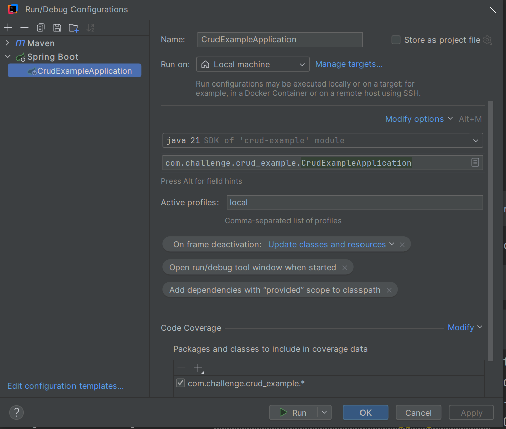
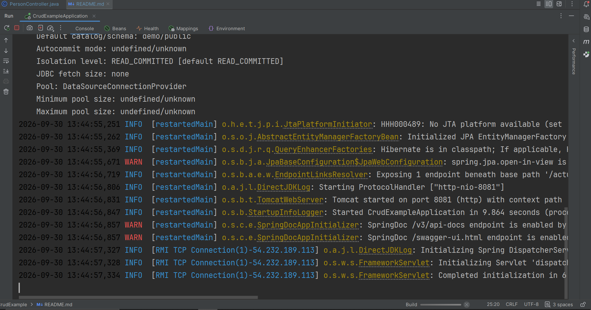

# Java + Spring Challenge

> a simple CRUD application.

## Getting Started

To run this application locally, you don't need to manually configure an external database. The database will automatically spin up along with the application.

To achieve this, you must set the "local" profile, that fires up docker and the database as the application starts.
### Prerequisites

* Java 21
* Maven
* Docker
* Docker compose

### Running the Application

1. Clone the repository:
   ```bash
   git clone https://github.com/RomarioBispo/CrudExample.git

2. Run maven clean install so all dependencies are installed:
   ```bash
   mvn clean install
3. Run the application using the following configuration:


The application should initialize successfully
